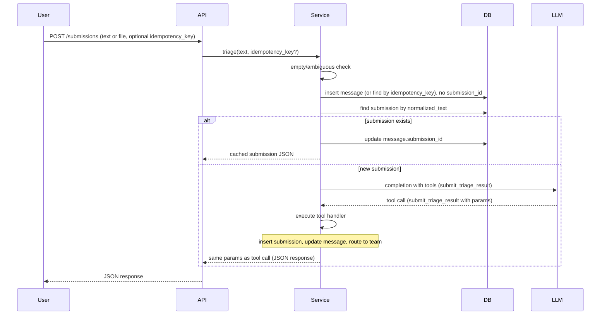

# Content Triage Agent – Implementation Plan

## Scope

- **In scope:** Application code, prompts, DB schema, seed data, tests, tools (stub API calls to teams), **branding (TRIAGE AGENT logo, lime green)**, CLI as a **long-running tool** with `-f` (one-off file), `-c` (interactive console), `-u` (web UI), **pipeline/progress animations** in console and UI, and documentation. All config via env (no hardcoded secrets).
- **Out of scope:** Creating the GitHub repo (manual step; plan will document push steps). RBAC can be stubbed initially and tightened later per your security rules.

---

## 1. Project layout

Match the requested structure and keep `src`-style layout:

```
classifier/
├── code/
│   ├── src/
│   │   ├── main.py              # FastAPI app entry
│   │   ├── config.py            # env-based settings
│   │   ├── db/                  # SQLite + models
│   │   ├── crud/                # submissions, messages, teams, users
│   │   ├── services/            # triage logic, LLM call, routing
│   │   ├── routers/             # API routes
│   │   ├── schemas/             # Pydantic request/response
│   │   └── tools/               # team routing “empty API calls”
│   └── static/                  # UI assets for -u mode (HTML/CSS/JS)
│   └── tests/
│       ├── test_triage_agent.py
│       ├── test_dedup_submission.py
│       └── test_edge_cases.py
├── prompts/
│   ├── triage_system.txt        # system prompt (rules, categories, output JSON)
│   └── planning_and_spec.md     # copy of your Untitled-1 spec text
├── docs/
│   ├── overview.md
│   ├── changelog.md
│   └── (feature docs as needed)
├── Pipfile
├── .env.example
└── README.md
```

**Why `code/src/crud`?** The `crud` folder holds the data-access layer: one place for Create/Read/Update/Delete against the database. Each module (e.g. `crud/submissions.py`, `crud/messages.py`) encapsulates SQLAlchemy queries and session handling. Routers and services call these functions instead of writing raw queries, which keeps business logic separate from persistence, avoids duplication, and makes testing easier (e.g. mock CRUD in unit tests). So yes, the `code/src/crud` folder is required.

---

## 2. Environment and .env.example

**Why .env.example?** All configurable values must come from environment variables or config files (no hardcoded paths, URLs, or credentials). `.env.example` documents every variable the app expects so developers and deployments know what to set; the app never reads `.env.example` at runtime.

**Variables to document in .env.example:**

- `DATABASE_URL` – SQLite connection string (e.g. `sqlite:///./classifier.db`).
- `LITELLM_MODEL` – Model for litellm (e.g. `gpt-4o-mini`).
- `OPENAI_API_KEY` – Provider API key (do not commit; use secret manager in prod).
- `LOG_LEVEL` – e.g. `INFO`, `DEBUG`.
- `ENVIRONMENT` – `dev`, `test`, or `prod`.
- `RATE_LIMIT_REQUESTS` – Max requests per window (e.g. `60`).
- `RATE_LIMIT_WINDOW_SECONDS` – Window in seconds (e.g. `60`).
- `SUBMISSION_MAX_LENGTH` – Max submission length (e.g. `10000`).
- `TEAM_ENGINEERING_URL`, `TEAM_CUSTOMER_SUPPORT_URL`, etc. – Optional team API base URLs.

Add a short comment in `.env.example` that secrets must not be committed and that production should use a secret manager or env injection.

---

## 3. Database (SQLite)

- **Engine:** SQLite via SQLAlchemy 2.x. All values from env (`DATABASE_URL`).
- **Schema:**
  - **submissions:** `id`, `text` (original submitted text), `normalized_text` (lowercased, trimmed, single spaces; used for dedup), `classification`, `actionability`, `routing_destination`, `confidence`, `detected_language`, `summary`, `flags` (JSON), `tags` (JSON), `created_at`, `updated_at`.
  - **teams:** `id`, `name`, `email`, `phone`, `slack_channel`, `slack_channel_id`, `slack_channel_name`, `slack_channel_type`, `created_at`, `updated_at`.
  - **users:** `id`, `name`, `email`, `phone`, `created_at`, `updated_at`.
  - **messages:** `id`, `submission_id` (nullable FK), `team_id` (nullable FK), `user_id` (nullable FK), `message` (text), `idempotency_key` (nullable, unique), `created_at`, `updated_at`.
- **Dedup:** Unique index on `submissions.normalized_text`. Lookup by `normalized_text`; store original `text` as submitted. Normalize before lookup/insert (e.g. strip, lower, collapse whitespace).
- **Performance:** Index on `submissions.normalized_text` (unique); index on `messages.submission_id` and `messages.idempotency_key` for fast lookups.
- **Migrations:** Create-all or single init script; add Alembic later if needed.

---

## 4. Flow (sequence)




- **Empty/ambiguous:** Before LLM, if content is blank or noise (e.g. only punctuation/emoji), return fixed JSON (e.g. `EMPTY`/`NOISE`, `NONE`, `DISCARD`) and optionally insert submission; do not call LLM.
- **Dedup:** Lookup by `normalized_text`. If found: set `message.submission_id`, return cached submission JSON. If not: call LLM with tools; on tool invocation, handler inserts submission, updates message, routes to team, returns tool params as response.
- **Idempotency:** If `idempotency_key` provided and a message with that key exists, return the existing result (same submission JSON) without creating a new message or calling LLM.

---

## 5. Content triage agent (LLM) – tool-based

- **Library:** `litellm`. Config: model and API keys from env (`OPENAI_API_KEY`, `LITELLM_MODEL`).
- **Prompt:** Stored in `prompts/triage_system.txt`: rules, classification categories, actionability, routing. Instruct the model to use the **tool** to submit its triage result (no free-form JSON in chat).
- **Single tool – `submit_triage_result`:** Define one tool the LLM must call with structured parameters. Parameters match the triage output: `classification`, `actionability`, `routing_destination`, `confidence`, `detected_language`, `summary`, `flags`, `tags`. Using a tool guarantees the response is valid, typed arguments (no raw JSON parsing).
- **Tool handler (executed when LLM calls the tool):** (1) Insert a row into `submissions` with `text`, `normalized_text`, and all tool parameters. (2) Update the current `message` row with `submission_id`. (3) Route to the appropriate team (see Routing) using `routing_destination`. (4) Return the same tool parameters as the API response. So: one tool call yields DB write + routing + response.
- **Fallback:** If the LLM does not call the tool (e.g. invalid or missing call), or tool execution fails, return a safe default JSON (e.g. `NOISE`, `NONE`, `DISCARD`) and log the error (no sensitive data).

---

## 6. Routing (“tools” / team API stubs)

- **Meaning of “tools”:** Implement as in-process calls that eventually perform HTTP requests to team endpoints. For now, stub: no real HTTP; log “routed to ENGINEERING” etc. and optionally enqueue or write to a table for later.
- **Mapping:** From `routing_destination` (e.g. `ENGINEERING`, `CUSTOMER_SUPPORT`) to a team record and a stub function (e.g. `tools/engineering.py`, `tools/customer_support.py`). Each stub receives submission id and payload; later replace with real API calls. No secrets in code; base URLs from env.

---

## 7. Branding and runner behavior

- **Logo/banner:** Show a text-based "TRIAGE AGENT" banner (similar in spirit to Claude’s text branding) in **lime green** when the tool starts. Use ANSI colour in the terminal (e.g. `\033[92m` or a library like `rich` for lime green); in the web UI (-u), render "TRIAGE AGENT" in lime green (e.g. `#32CD32` or `#00FF00`) as the header. Keep it simple and recognizable.
- **Run as a tool, not per-invocation:** The entry point (e.g. `run_triage.py` or `triage-agent`) is started **once**. Then the user either submits one file (-f), or enters **interactive** mode (-c or -u) where they can send **multiple** texts without restarting. No "run script → one submission → exit"; -c and -u stay running and accept repeated input.

---

## 8. API and input options

- **POST /submissions:** Body: `{ "text": "..." }` or multipart/file upload; optional `idempotency_key`. Validate input (max length from `SUBMISSION_MAX_LENGTH`, sanitize); reject or truncate as per policy. Return the triage JSON and optionally `submission_id`, `message_id`. **Rate limit** and **idempotency** as in section 9 (Configuration).
- **CLI / tool modes** (single entry point, e.g. `run_triage.py` or `triage-agent`):
  - **-f path:** One-off file submission. Read text from file, run triage once, show pipeline animation (or minimal progress), then print formatted result and JSON. Exit after that (or optionally prompt for another file; "for once" suggests one file then done).
  - **-c (console):** **Interactive** mode. Start once; show TRIAGE AGENT banner (lime green). Loop: prompt for text input (or multi-line), run triage, show **pipeline animation** (see below), then show formatted result and JSON. User can submit another text without restarting. Continue until quit (e.g. Ctrl+D / exit command).
  - **-u (UI):** **Web UI** mode. Start once; serve a simple UI (e.g. FastAPI static + one HTML page or a small SPA). Show "TRIAGE AGENT" in lime green in the header. Page has: text input, Submit button, and an area for **pipeline animation** (steps: e.g. Validating → Dedup check → LLM call → Routing → Done) and then **formatted result** (classification, routing, summary, etc.) and finally **JSON** response. User can submit **multiple** texts from the same page; each submission runs through the pipeline and updates the result area. No need to reload or restart.
- **Pipeline / progress animations (required for -c and -u):** For every submission (file, console, or UI), show the user where they are in the pipeline. In **console (-c):** use a spinner or step-by-step text (e.g. "Validating…" → "Checking dedup…" → "Calling LLM…" → "Routing…" → "Done") with simple ANSI or `rich` animation. In **UI (-u):** show the same steps visually (e.g. horizontal steps that light up, or a list that ticks off). At the end, show the **formatted** triage result (readable summary, classification, routing) and then the **raw JSON** response. Same behaviour for LLM call and any other activity (e.g. dedup lookup) so the user always sees progress, then final formatted output + JSON.

---

## 9. Configuration, performance, observability, rate limit, idempotency

- **Config:** All from env; document every variable in `.env.example` (see section 2 – Environment and .env.example).
- **Performance (required):** (1) Unique index on `submissions.normalized_text` for fast dedup lookup. (2) Index on `messages.submission_id` and `messages.idempotency_key`. (3) Dedup by `normalized_text` avoids duplicate LLM calls; no extra application-level cache required beyond DB.
- **Observability (required):** (1) Assign a **correlation/request ID** (e.g. UUID) to each submission request; include it in all log lines for that request. (2) Use **structured logging** (e.g. JSON format in prod) with fields: `request_id`, `timestamp`, `level`, `message`, and optional `submission_id`/`routing_destination`; never log raw submission content or tokens at INFO.
- **Rate limiting (required):** Protect `POST /submissions` by IP (and by user when RBAC is added). Use `RATE_LIMIT_REQUESTS` and `RATE_LIMIT_WINDOW_SECONDS` from env. Return 429 when exceeded.
- **Idempotency (required):** Accept optional `idempotency_key` in request body. If a `messages` row with that key exists, return the linked submission JSON and do not create a new message or call the LLM. Store `idempotency_key` on `messages` with a unique constraint.
- **Security:** No logging of raw submission content at INFO in tight loops; no tokens/passwords in logs. Validate/sanitize all inputs; use parameterized queries. Prepare for RBAC on `/submissions`; can stub initially.

---

## 10. Tests

- **Triage agent (unit):** Mock litellm; assert LLM is called with tools and tool handler receives correct params; assert fallback when no tool call. Cover 10 examples from INPUT EXAMPLES (empty, "?????", non-English, cancellation, bug report, positive feedback, etc.).
- **Dedup:** Same normalized_text (e.g. same text after normalize) returns cached submission JSON; no second LLM call; `message.submission_id` set.
- **Edge cases:** Empty input → EMPTY/NONE/DISCARD; very long input (reject or truncate); invalid UTF-8; LLM error or invalid tool call → default safe JSON; DB failure → proper error and no partial state.
- **Rate limit:** Assert 429 after N requests within window (per IP).
- **Idempotency:** Same `idempotency_key` returns same submission result; no duplicate message or LLM call.

---

## 11. Seed data

- **teams:** Insert rows for ENGINEERING, CUSTOMER_SUPPORT, PRODUCT_MANAGEMENT, FEEDBACK, ESCALATION, LOCALIZATION, DISCARD (names/emails/placeholders as in spec).
- **users:** A few placeholder users for `messages.user_id` and tests.
- Script or CLI command (e.g. `python -m src.db.seed`) to run once; idempotent where possible.

---

## 12. Documentation and changelog

- **README.md:** How to run (pipenv install, env vars, `uvicorn` or `python main.py`), how to run the tool (`-f` file, `-c` interactive console, `-u` web UI), pipeline animations and output (formatted result + JSON), how to test (`pytest code/tests`), how to contribute and report issues. No Google Fonts; use local fonts if the UI ships any.
- **docs/overview.md:** High-level architecture, flow diagram (like the sequence above), and link to other docs.
- **docs/changelog.md:** Maintained per workspace rules (every change logged with date and attribution).
- **prompts/planning_and_spec.md:** Paste the full text from your Untitled-1 (lines 1–142) so it’s versioned and available to future LLMs.

---

## 13. Parallelizable tasks (for multiple agents)

Tasks are split so different agents can work in parallel with minimal overlap. Dependencies are explicit; finish a track before starting any track that depends on it.

**Track 1 – Foundation** (no code dependencies)

- Create project skeleton: `code/`, `code/src/`, `prompts/`, `docs/`.
- Add `config.py` (read all env vars from section 2), `Pipfile` with FastAPI, litellm, SQLAlchemy, uvicorn, pytest, etc.
- Create `.env.example` with every variable listed in section 2 and a short comment that secrets must not be committed.
- Define DB schema (SQLAlchemy models): `submissions` (with `normalized_text`), `teams`, `users`, `messages` (with `idempotency_key`). Init script or create-all. Add indexes (unique on `normalized_text`, indexes on `messages.submission_id`, `messages.idempotency_key`).
- Seed script: insert teams (ENGINEERING, CUSTOMER_SUPPORT, etc.) and placeholder users; idempotent.
- CRUD layer: `crud/submissions.py`, `crud/messages.py`, `crud/teams.py`, `crud/users.py` with create/get/update as needed. Normalize text helper (e.g. lower, strip, collapse spaces) used when creating/looking up submissions.
- **Output:** App can start, DB created, seed data present, CRUD used by services.

**Track 2 – Prompts and LLM tool definition** (depends only on spec; can start in parallel with Track 1)

- Write `prompts/triage_system.txt` from spec: rules, categories, actionability, routing. Instruct model to call the tool with the triage result.
- Define the tool schema for `submit_triage_result`: parameters = classification, actionability, routing_destination, confidence, detected_language, summary, flags, tags (JSON schema or OpenAPI-style for litellm).
- Copy full spec into `prompts/planning_and_spec.md`.
- **Output:** Prompt file and tool schema ready to plug into litellm.

**Track 3 – Service and routing** (depends on Track 1 and Track 2)

- Implement tool handler: given tool args + current message id + raw text + normalized_text, insert submission, update message.submission_id, call router.
- Implement routing: map `routing_destination` to team; for each destination, stub function (e.g. in `tools/`) that logs or enqueues; later replace with HTTP. Use env for team URLs if needed.
- Triage service: (1) empty/noise check → return default JSON and optionally insert submission. (2) Idempotency: if idempotency_key and message exists, return existing submission. (3) Dedup: lookup by normalized_text; if found, update message, return cached. (4) Else: call litellm with tools; on tool call, run tool handler; return tool params. (5) Fallback if no tool call or error.
- **Output:** Single entry point (e.g. `triage(text, idempotency_key?, message_id?)`) that returns triage JSON; used by API and CLI.

**Track 4 – API and middleware** (depends on Track 3)

- FastAPI app: `main.py`, include router for `POST /submissions` (body: text or file; optional idempotency_key). Validate length, sanitize. Call triage service; return JSON + submission_id/message_id.
- Middleware or dependency: add correlation/request ID (UUID) to each request; structured logging (JSON in prod) with request_id.
- Rate limit: per-IP (and per-user when RBAC exists) using RATE_LIMIT_* env; return 429 when exceeded.
- **Output:** API runnable; rate limit and observability in place.

**Track 5 – CLI and UI (tool runner)** (depends on Track 3)

- Single entry point (e.g. `run_triage.py`): show **TRIAGE AGENT** banner in **lime green** (ANSI or `rich`) on startup.
- **-f path:** One-off file: read file, run triage, show pipeline animation (steps: Validating → Dedup → LLM → Routing → Done), then formatted result + JSON; exit.
- **-c:** Interactive console: loop prompt for text; for each submission show pipeline animation (spinner or step-by-step), then formatted result + JSON; accept multiple submissions until quit.
- **-u:** Web UI: serve static UI (e.g. from `static/`); header "TRIAGE AGENT" in lime green; text input + submit; for each submission show pipeline animation (visual steps), formatted result, then JSON; multiple submissions without reload. Use same triage service/API under the hood.
- **Output:** Tool runnable as long-running process; -f one-off, -c interactive with animations, -u UI with pipeline animation and formatted result + JSON.

**Track 6 – Tests** (depends on Track 3 and optionally Track 4)

- Unit tests: triage agent (mock litellm; assert tool call args and fallback). Dedup: same normalized_text returns cached result and no second LLM call. Edge cases: empty, long input, invalid UTF-8, LLM error → default JSON. Rate limit: 429 after N requests. Idempotency: same key returns same result.
- **Output:** pytest passes for all above.

**Track 7 – Docs** (can start once layout is fixed; minimal dependency)

- README: run (pipenv, env, uvicorn), test (pytest), use API and CLI (-f/-c), contribute, report bugs. Point to .env.example.
- docs/overview.md: architecture, flow diagram, link to changelog and spec.
- docs/changelog.md: created and updated per workspace rules on every change.
- **Output:** New contributors can run, test, and extend.

**Execution order for parallel agents:** Run **Track 1** and **Track 2** in parallel. When both are done, run **Track 3**. When Track 3 is done, run **Track 4**, **Track 5**, and **Track 6** in parallel. **Track 7** can run in parallel with Tracks 4–6 or after. GitHub: create repo manually, then `git init`, add remote, push.