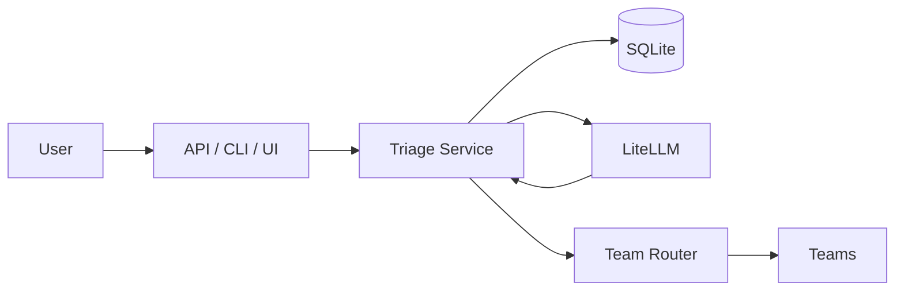

# Content Triage Agent – Overview

## Purpose

The Content Triage Agent analyzes free-text submissions (e.g. support messages, feedback) and returns a structured classification, actionability, and routing destination. It is used by a content operations team to route items to the right team (Engineering, Customer Support, Product, etc.) without manual tagging.

## Architecture

## Flow

1. **Input**: User submits text via API (`POST /submissions`), CLI (`-f` file or `-c` console), or Web UI (`-u`).
2. **Validation**: Text is validated and truncated to `SUBMISSION_MAX_LENGTH` if needed.
3. **Idempotency**: If `idempotency_key` is provided and a message with that key exists, the cached submission result is returned and the flow stops.
4. **Empty/noise**: If the text is empty or clearly noise (e.g. only punctuation), a default result (EMPTY/NOISE, NONE, DISCARD) is stored and returned without calling the LLM.
5. **Dedup**: If a submission with the same **normalized text** (lowercased, trimmed, collapsed spaces) already exists, the message is linked to it and the cached result is returned.
6. **LLM**: For new content, the service calls LiteLLM with a **tool** (`submit_triage_result`). The model must call this tool with classification, actionability, routing_destination, confidence, detected_language, summary, flags, and tags.
7. **Tool handler**: When the LLM calls the tool, the handler inserts a row into `submissions`, updates the `message` with `submission_id`, and routes to the appropriate team (stub: log only; later HTTP).
8. **Response**: The same tool parameters are returned as the API/CLI/UI response (formatted result + JSON).

## Components

- **Config**: All settings from environment (see `.env.example`).
- **DB**: SQLite; tables: `submissions` (with `normalized_text` for dedup), `teams`, `users`, `messages` (with `idempotency_key`).
- **CRUD**: Data access for submissions, messages, teams, users; `normalize_text()` for dedup.
- **Triage service**: Orchestrates empty check, idempotency, dedup, LLM call with tools, tool handler, fallback.
- **Router**: Maps `routing_destination` to team; stub implementation logs only.
- **API**: FastAPI app with `POST /submissions`, rate limit (per-IP), request ID middleware.
- **CLI/UI**: `run_triage.py` with `-f` (file), `-c` (interactive console), `-u` (web UI); TRIAGE AGENT banner (lime green); pipeline steps; formatted result + JSON.

## Documentation index

- [Changelog](changelog.md) – Change history.
- [Planning and spec](../prompts/planning_and_spec.md) – Original product/flow spec.
